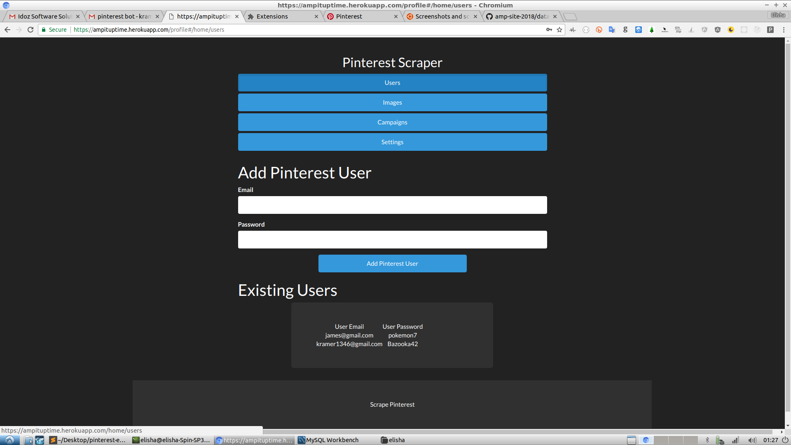
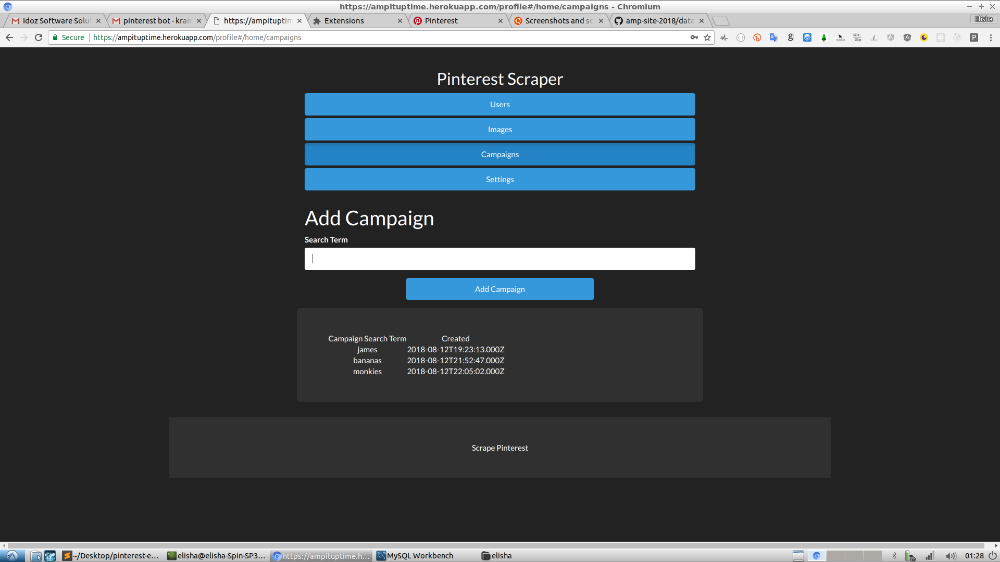
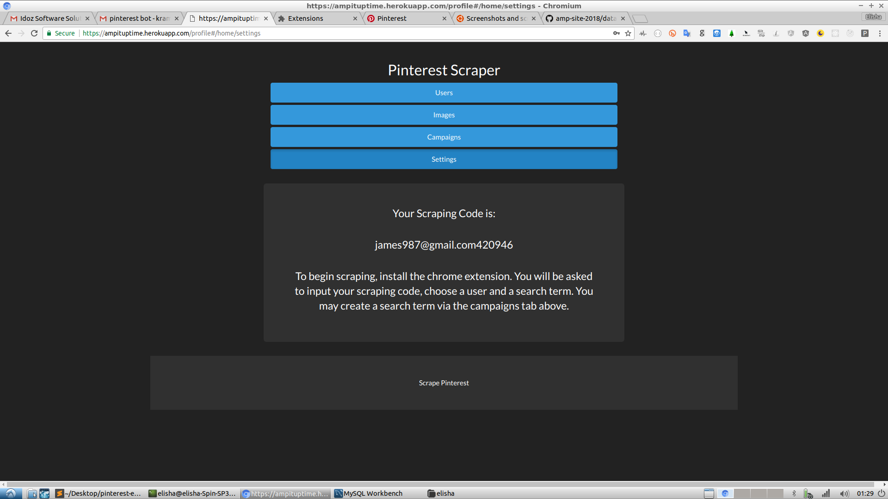
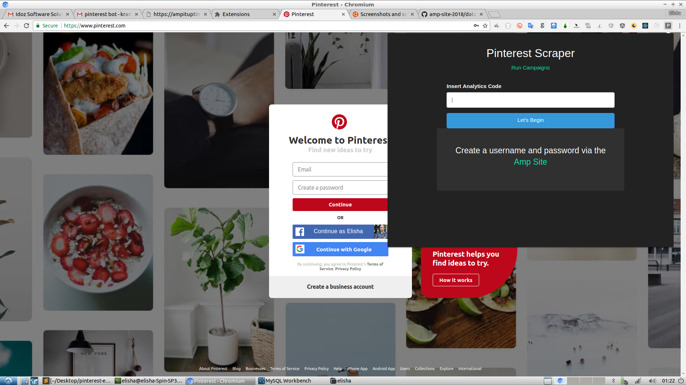
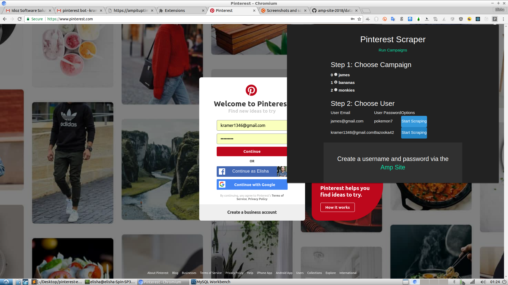
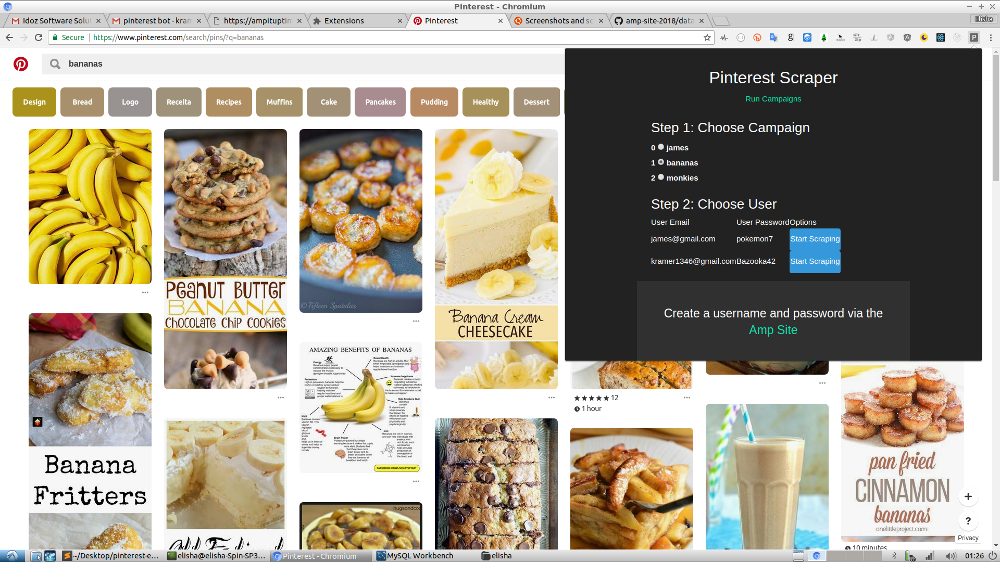
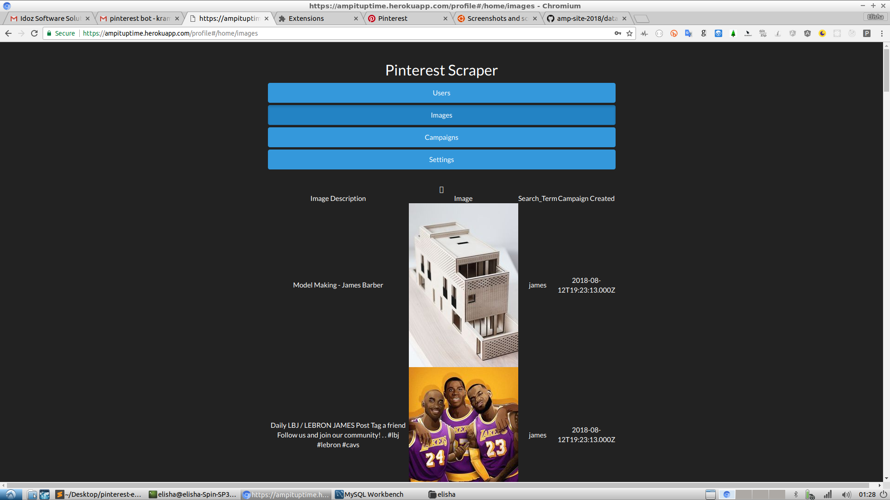

Create a Campaign Search via the Admin GUI and fetch images from Pinterest!

<h5>Step 1: Via the Admin GUI. Add the credentials of your Pinterest User</h5>



<br>

<h3>Step 2: Create your campaign Search Term</h3>



<br>

<h3>Step 3: Copy your Scraping Code</h3>



<br>

<h5>Step 4: To work with the extension, you should navigate to 'https://www.pinterest.com/' and verify that you are logged out. You will see the little "P" icon at the top right of your browser once you load the unpacked extension. Click the icon. It will allow you to input the scraping_code mentioned above. Your campaign Search_terms and saved_users will already be loaded there and you can choose the combo of user and search_term to start scraping with.</h5>



<br>



<br>



<br>

<h3>Step 5: Now that the scraping is complete, go back to your Admin GUI (to the 'Images' Tab) - all your scraped images willl appear there.</h3>



<br>

<h1>Getting Started</h1>

You can view the admin gui here:

https://ampituptime.herokuapp.com/login

Here is a demo account to log in with:

Username: james987@gmail.com
Password: james

The site is deployed to heroku - it also contains all the API calls necessary for the project.

The server code is available here: https://github.com/ElishaKay/amp-site-2018

The actual scraping is being done by a Chrome Extension. Once a client creates an account via the Admin UI, he is provided with a 'scraping_code'. The client will then need to download the Chrome Extension, input the scraping_code, and choose a Pinterest User, and saved Search Term that he defined within the admin UI.

I've pointed the extensions API Calls to the live heroku server mentioned above - you can also easily point the API calls to localhost:5000 for testing purposes (just one variable to change).


<h1>Technologies Used</h1>

- NodeJS Server
- MySQL Database
- AngularJS - on both the Admin GUI and Chrome Popup (and the UI-Router library that allows for changing views)

Both the Extension and Admin GUI are interacting with the same server and database.

How the extension works:

The 2 important pages of the chrome extension are the <a href="https://github.com/ElishaKay/pinterest_bot/tree/master/js/app">popup.js and content.js pages.</a>

The big challenge of scraping data from Pinterest is the 'Content Security Policy' of Pinterest - this prevented me from making POST requests directly from the Pinterest DOM. Instead, I had to put all the interaction with the server within the popup.js page.  In short, the 'popup.js' and 'content.js' pages have different strengths: The 'content.js' page has direct access to the Pinterest DOM, but the 'popup.js' page needs to handle all communication with the server. That means that these 2 pages need to play together nicely.

Here's the data flow of the Extension:

1. Client presses popup and the popup view renders.
2. Client inserts their analytics code - this causes the popup to make a GET request to the server to receive the client's campaigns and users.
3. The client chooses a campaign and a user and presses 'Start Scraping' - this begins the communication between the 'popup.js' and 'content.js' pages. The popup.js page passes the following data to the 'content.js' page (client_id, search_term, campaign_id and user_credentials). 
4. Now that Content.js has the data it needs, it begins the process of scraping. First thing it does is log in with the User Credentials. Content.js also saves the necessary variables to localStorage.
5. Once the bot is logged in, it automatically navigates to 'https://www.pinterest.com/search/pins/?q='+search_term;
6. The relevant images are now finally loaded unto the page. Content.js scrapes them and passes their data backup to the still open popup. 
7. Now popup.js finally has the imageData it needed. It passes that data straight to the server.
8. The NodeJS server (with the MySQL library installed) saves the imageData within the database.


I hope that clarifies some of the design decisions of the project. This type of structure can support scraping on any social network. Why? Github.com and LinkedIn.com know when someone is making post requests directly from the DOM. But, there's no way they can know what's happening from the 'popup.js' page (or the 'background.js' pages) because popup.js are part of the Chrome Browser's Internal Structure.

Here's a code example of how the communication between popup.js and content.js work:


Content.js:
```javascript
chrome.runtime.sendMessage({type: "imageData", images: stuffToSave});
```

Popup.js (or Background.js):
```javascript
chrome.runtime.onMessage.addListener(
        function(message, sender, sendResponse) {
            switch(message.type) {
                case "imageData":
                    console.log('got image Data from content.js: ', message)

```


Because the chrome.runtime.onMessage API goes out to the content.js, background.js, and popup.js pages, Chrome Extension developers frequently use the JavaScript switch statement when listening for these events.

You can use the following template in any of your main extension pages:

```
chrome.runtime.onMessage.addListener(
        function(message, sender, sendResponse) {
            switch(message.type) {
            	case x:
				    // code block
				    break;
				case y:
				    // code block
				    break;
				default:
				    // code block
            }
        }
);
```

<h1>API Docs</h1>

All of the API Calls are located within the <a href="https://github.com/ElishaKay/amp-site-2018/blob/master/app/routes.js">routes.js file of the server</a>

As mentioned, the server is currently deployed at: https://ampituptime.herokuapp.com/. Therefore, if you navigate to https://ampituptime.herokuapp.com/getimages/james987@gmail.com420946 then you'll see all of the saved images of a given client - (in this case, james987@gmail.com). To add more security, you can make the client code more complex.

<h3>Calls Made only from Admin GUI:</h3>

```javascript
// Note: the 'isLoggedIn' function verifies that only logged-in users can make the API Call
app.post('/signup', passport.authenticate('local-signup', 

app.post('/login', passport.authenticate('local-login',

app.get('/logout',

app.get('/getimages/:client_analytics_code',

app.post('/add-pinterest-user', isLoggedIn,

app.post('/create-campaign', isLoggedIn,
```

<h3>Calls made from the Chrome Extension (popup.js or background.js pages):</h3>

```javascript
app.post('/save-images', 
```

<h3>Calls made from both the Chrome Extension and Admin GUI:</h3>

```javascript
//Gets the credentials of the Pinterest Users saved by the client
app.get('/getcreds/:client_analytics_code'

app.get('/getcampaigns/:client_analytics_code', 
```

<h3>Summary</h3>

In summary: Each API call has its own separate purpose. They are easy to reason about. I created these API calls with the big question being: "which data do I need to POST and GET for the Admin GUI and which data do I need to POST and GET from the Chrome Extension. To add new features - you can make edits to each API call (without worrying about different aspects of the application breaking).
